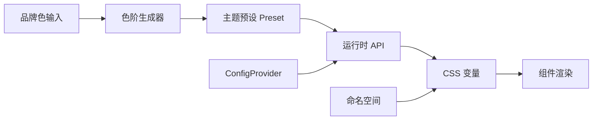

# 主题定制

ZC UI 提供完整的运行时主题定制能力，包括：品牌色动态切换、主题预设系统、组件级主题覆写、CSS 变量命名空间、CSS Layer 优先级控制，以及主题色阶生成工具。

## 概览



## 运行时品牌色切换

通过 `setBrandColor()` 或 `setBrandColors()` 在运行时动态切换品牌色，自动生成完整的 50–950 色阶。

### 基本用法

```ts
import { setBrandColor, setBrandColors } from '@zc-ui/theme'

// 切换单个品牌色
setBrandColor('primary', '#722ed1')

// 切换多个品牌色
setBrandColors({
  primary: '#722ed1',
  success: '#52c41a',
  danger: '#ff4d4f',
})
```

### 通过 ConfigProvider 切换

<DemoBlock>

```vue
<template>
  <div>
    <p style="margin-bottom: 16px">选择主题色：</p>
    <ZcSpace>
      <ZcButton
        v-for="color in colors"
        :key="color.value"
        :style="{ background: color.value, borderColor: color.value }"
        @click="changeColor(color.value)"
      >
        {{ color.label }}
      </ZcButton>
    </ZcSpace>

    <div style="margin-top: 24px">
      <ZcButton type="primary">Primary 按钮</ZcButton>
      <ZcButton type="primary" style="margin-left: 8px" plain>Plain 按钮</ZcButton>
    </div>
  </div>
</template>

<script setup lang="ts">
import { setBrandColor } from '@zc-ui/theme'

const colors = [
  { label: '蓝色 (默认)', value: '#409eff' },
  { label: '紫色', value: '#722ed1' },
  { label: '绿色', value: '#00b96b' },
  { label: '红色', value: '#f5222d' },
  { label: '橙色', value: '#fa8c16' },
]

function changeColor(color: string) {
  setBrandColor('primary', color)
}
</script>
```

</DemoBlock>

## 主题预设系统

类似 Naive UI 的 `darkTheme` / `lightTheme`，ZC UI 提供内置主题预设，并支持自定义创建。

### 内置预设

```ts
import { lightTheme, darkTheme } from '@zc-ui/theme'

// 当前预设的变量
console.log(lightTheme.variables['--color-zc-primary-500']) // '#409eff'
console.log(darkTheme.variables['--color-zc-bg-base'])      // '#1d1d1d'
```

### 创建自定义预设

```ts
import { createTheme, mergeThemes, darkTheme } from '@zc-ui/theme'

// 基于品牌色创建
const brandTheme = createTheme({
  name: 'purple-brand',
  brandColors: { primary: '#722ed1' },
  componentOverrides: {
    Button: {
      '--zc-button-border-radius': '8px',
      '--zc-button-font-weight': '600',
    },
  },
})

// 合并预设（后者覆盖前者）
const purpleDark = mergeThemes(darkTheme, brandTheme)
```

### 预设注册与切换

```ts
import { registerTheme, switchTheme, createTheme } from '@zc-ui/theme'

// 注册多个主题
registerTheme('brand', createTheme({ brandColors: { primary: '#722ed1' } }))
registerTheme('dark', darkTheme)
registerTheme('light', lightTheme)

// 按名称切换
switchTheme('brand')
switchTheme('dark')
```

### 应用预设

```ts
import { applyTheme, darkTheme } from '@zc-ui/theme'

// 应用到 document
applyTheme(darkTheme)

// 应用到指定元素
const el = document.querySelector('.my-section')
applyTheme(darkTheme, { target: el })
```

## 组件级主题覆写 (themeOverrides)

通过 ConfigProvider 的 `themeOverrides` 属性，可以按组件粒度覆盖 CSS 变量。

<DemoBlock>

```vue
<template>
  <ZcConfigProvider
    :theme-overrides="{
      Button: {
        '--zc-button-border-radius': '20px',
      },
      Tag: {
        '--zc-tag-border-radius': '0',
      },
    }"
  >
    <div style="display: flex; gap: 12px; align-items: center">
      <ZcButton type="primary">圆角按钮</ZcButton>
      <ZcTag type="success">直角标签</ZcTag>
    </div>
  </ZcConfigProvider>
</template>
```

</DemoBlock>

### 完整示例

```vue
<template>
  <ZcConfigProvider
    :brand-colors="{ primary: '#722ed1' }"
    :theme-variables="{ '--radius-zc-base': '10px' }"
    :theme-overrides="{
      Button: { '--zc-button-font-weight': '700' },
      Input: { '--zc-input-border-color': '#d9d9d9' },
      Card: { '--zc-card-shadow': '0 4px 12px rgba(0,0,0,0.1)' },
    }"
  >
    <App />
  </ZcConfigProvider>
</template>
```

## CSS 变量命名空间

支持多套 CSS 变量前缀并存，适用于白标应用或多品牌场景。

```ts
import { createNamespace, applyNamespace } from '@zc-ui/theme'

// 创建命名空间
const ns1 = createNamespace('brand-a', {
  brandColors: { primary: '#722ed1' },
})
const ns2 = createNamespace('brand-b', {
  brandColors: { primary: '#00b96b' },
})

// 应用到不同区域
applyNamespace(document.querySelector('.section-a'), ns1)
applyNamespace(document.querySelector('.section-b'), ns2)
```

在 CSS 中使用命名空间变量：

```css
.section-a .my-button {
  background: var(--color-brand-a-primary-500);
}

.section-b .my-button {
  background: var(--color-brand-b-primary-500);
}
```

## CSS Layer 支持

ZC UI 使用 CSS `@layer` 控制样式优先级，避免样式冲突。

### 层级顺序（从低到高）

| 层级 | 说明 |
| --- | --- |
| `zc-reset` | CSS 重置样式 |
| `zc-tokens` | 设计令牌（CSS 变量定义） |
| `zc-base` | 基础元素样式 |
| `zc-components` | 组件样式 |
| `zc-overrides` | 用户/运行时主题覆写（最高优先级） |

### 在自定义样式中使用

```css
/* 你的覆写样式放入 zc-overrides 层，自动获得最高优先级 */
@layer zc-overrides {
  .my-custom-button {
    background: var(--color-zc-primary-500);
  }
}
```

### 编程方式

```ts
import { wrapInLayer, cssLayerDeclaration } from '@zc-ui/theme'

const myCss = wrapInLayer('zc-overrides', `
  .my-button { border-radius: 8px; }
`)
```

## 主题色阶生成工具

输入单个品牌色，自动生成完整的 50–950 色阶。

```ts
import { generateColorScale, generatePalette } from '@zc-ui/theme'

// 生成单个色阶
const scale = generateColorScale('#722ed1')
// {
//   50: '#f9f0ff',
//   100: '#efdbff',
//   ...
//   500: '#722ed1',
//   ...
//   950: '#220938'
// }

// 生成完整调色板
const palette = generatePalette({
  primary: '#722ed1',
  success: '#52c41a',
  danger: '#ff4d4f',
})
```

### 色阶生成 CSS 变量

```ts
import { generatePalette, paletteToCssVars, paletteToCssText } from '@zc-ui/theme'

const palette = generatePalette({ primary: '#722ed1' })

// 转为 CSS 变量对象
const vars = paletteToCssVars(palette)
// { '--color-zc-primary-50': '#f9f0ff', ... }

// 转为 CSS 文本
const css = paletteToCssText(palette, ':root')
// :root { --color-zc-primary-50: #f9f0ff; ... }
```

## 暗色模式

```ts
import { applyTheme, darkTheme, lightTheme, applyDarkMode } from '@zc-ui/theme'

// 方法 1：使用预设
applyTheme(darkTheme)
applyTheme(lightTheme)

// 方法 2：直接切换 class
applyDarkMode(true)   // 添加 .dark 类
applyDarkMode(false)  // 移除 .dark 类

// 方法 3：通过 useDark 组合式函数
import { useDark } from '@zc-ui/hooks'
const { isDark, toggle } = useDark()
```

## 主题控制器 (Theme Controller)

```ts
import { createThemeController, darkTheme } from '@zc-ui/theme'

const controller = createThemeController()

controller.apply(darkTheme)                 // 应用预设
controller.setBrandColor('primary', '#722ed1') // 切换品牌色
controller.setVariable('--my-var', '20px')  // 设置 CSS 变量
controller.toggleDark()                     // 切换暗色模式
controller.clear()                          // 清除所有运行时覆写
```

## API 参考

### 运行时 API

| 函数 | 说明 |
| --- | --- |
| `applyTheme(preset, options?)` | 应用完整主题预设 |
| `setBrandColor(name, hex, options?)` | 设置单个品牌色 |
| `setBrandColors(palette, options?)` | 设置多个品牌色 |
| `setThemeVariable(name, value, options?)` | 设置单个 CSS 变量 |
| `removeThemeVariable(name, options?)` | 移除 CSS 变量 |
| `applyDarkMode(isDark, target?)` | 切换暗色模式 |
| `clearThemeOverrides(options?)` | 清除所有运行时覆写 |
| `registerTheme(name, preset)` | 注册命名主题 |
| `switchTheme(name, options?)` | 切换到已注册主题 |
| `createThemeController(options?)` | 创建主题控制器 |

### 主题预设 API

| 函数 | 说明 |
| --- | --- |
| `createTheme(options)` | 创建自定义主题预设 |
| `mergeThemes(...presets)` | 合并多个预设 |
| `getComponentOverrides(theme, name)` | 获取组件覆写 |
| `themeToCssText(theme, selector?)` | 预设转 CSS 文本 |

### 色阶生成 API

| 函数 | 说明 |
| --- | --- |
| `generateColorScale(hex)` | 生成 50–950 色阶 |
| `generatePalette(input)` | 生成完整调色板 |
| `paletteToCssVars(palette, prefix?)` | 转为 CSS 变量对象 |
| `paletteToCssText(palette, selector?)` | 转为 CSS 文本 |
| `getContrastRatio(hex1, hex2)` | 计算对比度 |
| `getReadableTextColor(bgHex)` | 获取最佳文字颜色 |

### 命名空间 API

| 函数 | 说明 |
| --- | --- |
| `createNamespace(name, options)` | 创建命名空间 |
| `applyNamespace(element, ns)` | 应用命名空间到元素 |
| `removeNamespace(element, ns)` | 移除命名空间 |
| `createVarResolver(name)` | 创建变量名解析器 |
